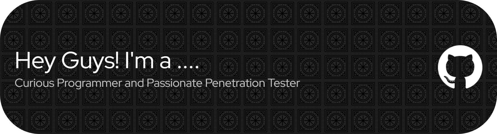

## Projects
* [BlackHatOps](https://github.com/CyberForgeEx/BlackHatOps) – Basic Offensive Security operations with C programs for reverse shells, remote process injection, and custom backdoor implementations.
* [EntroPass](https://github.com/CyberForgeEx/EntroPass) - Password strength checker based on shannon's entropy with computational cracking time.
* [PSMultiTool](https://github.com/CyberForgeEx/PSMultiTool) - Simple System administration utilities for Windows.
* [IdeaForgeAI](https://ideaforgeai05.pythonanywhere.com/) - AI-powered tool that is designed to evaluate your software project ideas and provide insights.
*  Currently researching about how the each an every technical concepts working on the art of exploitation. 

## Things that I love to do.
* Building solutions to solve a security problems through programming and automation.
* Conducting ethical hacking exercises and penetration testing challenges.
* Mastering tools like Nmap, Metasploit, Burp Suite, and Wireshark.
* Building expertise in complete cybersecurity infrastructure.
* Approaching Offensive security from an defensive perspective.

## Education & Certifications
* **Computer Science Foundations (CS50x)** - Harvard University (August 2025 - Present)
* **Certified Ethical Hacker (CEH v13)** - EC-Council via Edoxi Institute (March 2025 - May 2025)
* **Diploma in Ethical Hacking** - Alison (January 2023 - April 2023)
* **Linux Fundamentals** - Cybrary
* **Python for Beginners** - University of Moratuwa.

## Technical Expertise
**Security Tools & Frameworks:**
* Vulnerability & Penetration Testing: Burp Suite, Nmap, Metasploit, Nessus, OWASP ZAP
* Operating Systems: Windows, Linux (Ubuntu, Kali), Comfortable with both - CLI & GUI.
* Ability disect the inner working principles of security tools.

**Programming & Development:**
* Languages: C, Python, Bash, PowerShell, Javascript, C#, ASM (x86)
* Networking: Network Protocols, Socket operations, All Core concepts of networks.

**Current Statistics**
 

  
  

---

  

  <em>"Anyone can write code that a computer can understand. Good programmers write code that humans can understand."</em>

    

  
## Contact Me
You can reach me at <vasandilaksan@gmail.com>
